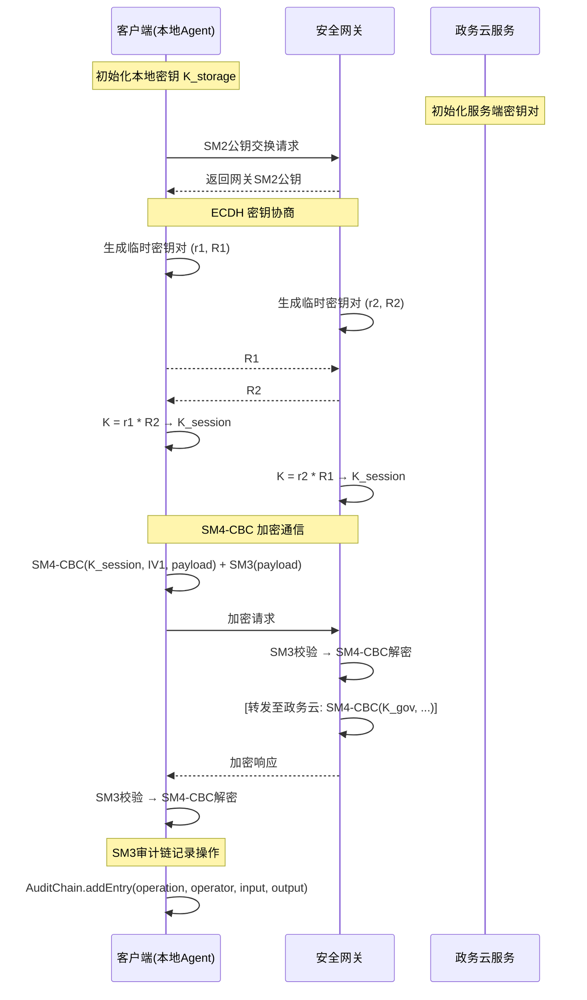

# 安全合规设计文档

> 文档版本：v1.0
> 编制日期：2026-05-14
> 编制依据：GB/T 22239-2019（等保2.0）、GB/T 39786-2021、GB/T 32905/32907/32918（国密标准）、GB/T 37973-2019（数据安全管理）、GovMCP 国密实现

---

## 目录

1. [设计目标](#1-设计目标)
2. [国密加密通道设计](#2-国密加密通道设计)
3. [不可篡改审计链](#3-不可篡改审计链)
4. [数据隔离方案](#4-数据隔离方案)
5. [身份认证](#5-身份认证)
6. [等保2.0合规要求](#6-等保20合规要求)
7. [政务数据分级保护](#7-政务数据分级保护)
8. [审批安全](#8-审批安全)
9. [安全运维](#9-安全运维)
10. [合规检查清单](#10-合规检查清单)
11. [实现计划](#11-实现计划)

---

## 1. 设计目标

### 1.1 政务安全合规要求

Taiji Agent 作为政务场景的智能体系统，必须满足以下政务安全合规要求：

| 序号 | 要求 | 来源 | 等级 |
|------|------|------|------|
| R01 | 全员使用国密算法（SM2/SM3/SM4） | GM/T 000x 系列 | **强制** |
| R02 | 数据传输全程加密 | 等保2.0 三级 | **强制** |
| R03 | 数据存储加密 | 等保2.0 三级 | **强制** |
| R04 | 不可篡改审计日志 | 等保2.0 三级 | **强制** |
| R05 | 多租户数据严格隔离 | 政务数据分级管理 | **强制** |
| R06 | 身份认证与权限控制 | GB/T 22239-2019 | **强制** |
| R07 | 审批操作不可抵赖 | 电子签名法 | **强制** |
| R08 | 敏感数据脱敏 | 个人信息保护法 | **强制** |
| R09 | 数据分级保护 | 数据安全法 | **强制** |
| R10 | 漏洞管理与安全运维 | 等保2.0 三级 | **推荐** |

### 1.2 等保2.0合规目标

依据《信息安全技术 网络安全等级保护基本要求》（GB/T 22239-2019）三级安全要求，Taiji Agent 需达到：

- **S3A3G3** 级别（三级系统）
- 覆盖物理安全、网络安全、主机安全、应用安全、数据安全、安全管理六大维度
- 每年通过等保测评机构的合规评估

### 1.3 安全架构原则

```
┌─────────────────────────────────────────────────────────────┐
│                 安全架构核心原则                                │
├─────────────────────────────────────────────────────────────┤
│                                                              │
│  🔒 纵深防御 (Defense in Depth)                              │
│     网络层 → 主机层 → 应用层 → 数据层 → 管理层的多层防护       │
│                                                              │
│  🔑 最小权限 (Least Privilege)                               │
│     每个角色/租户只拥有完成任务所必需的最小权限集合             │
│                                                              │
│  📝 默认安全 (Secure by Default)                             │
│     所有配置默认安全，非白名单即拒绝                           │
│                                                              │
│  🔗 全链路加密 (End-to-End Encryption)                       │
│     客户端 ↔ 网关 ↔ 政务云 三层国密加密通道                    │
│                                                              │
│  🔐 可审计 (Accountability)                                  │
│     所有敏感操作记录在 SM3 哈希链中，不可篡改、不可抵赖         │
│                                                              │
│  🛡️ 数据分级 (Data Classification)                          │
│     L1公开 / L2内部 / L3敏感 / L4机密 四级数据保护             │
│                                                              │
└─────────────────────────────────────────────────────────────┘
```

---

## 2. 国密加密通道设计

### 2.1 SM2非对称加密

#### 2.1.1 密钥生成

基于 GB/T 32918-2016 标准的 SM2 椭圆曲线参数实现密钥对生成：

```python
# 源: govmcp/crypto/sm2.py — SM2 椭圆曲线参数
SM2_P = 0xFFFFFFFEFFFFFFFFFFFFFFFFFFFFFFFFFFFFFFFF00000000FFFFFFFFFFFFFFFF
SM2_A = 0xFFFFFFFEFFFFFFFFFFFFFFFFFFFFFFFFFFFFFFFF00000000FFFFFFFFFFFFFFFC
SM2_B = 0x28E9FA9E9D9F5E344D5A9E4BCF6509A7F39789F515AB8F92DDBCBD414D940E93
SM2_N = 0xFFFFFFFEFFFFFFFFFFFFFFFFFFFFFFFF7203DF6B21C6052B53BBF40939D54123
SM2_G_X = 0x32C4AE2C1F1981195F9904466A39C9948FE30BBFF2660BE1715A4589334C74C7
SM2_G_Y = 0xBC3736A2F4F6779C59BDCEE36B692153D0A9877CC62A474002DF32E52139F0A0
```

**密钥生成流程**：

```
1. 生成随机数 d (256bit, 1 < d < SM2_N - 1)
2. 计算公钥 P = d * G（椭圆曲线标量乘法）
3. 私钥: d (256bit 随机数)
4. 公钥: (P_x, P_y) (512bit 椭圆曲线点)
5. 输出密钥对 (d, P)
```

**密钥管理策略**：

| 密钥类型 | 存储方式 | 轮换周期 | 生成时机 |
|----------|----------|----------|----------|
| 客户端 SM2 密钥对 | 本地 SM4 加密存储 | 30天 | 首次登录时生成 |
| 网关 SM2 密钥对 | HSM 硬件安全模块 | 90天 | 系统初始部署 |
| 政务云 SM2 密钥对 | HSM 硬件安全模块 | 90天 | 系统初始部署 |
| 会话密钥 K_session | 内存仅本次会话 | 24小时 | 每次连接协商 |

#### 2.1.2 ECDH密钥协商

使用 SM2 ECDH 协议协商会话级对称加密密钥：

```
客户端                           网关/政务云
  │                                │
  │  生成临时密钥对 (r1, R1)       │
  │  ────────── R1 ──────────────► │
  │                                │  生成临时密钥对 (r2, R2)
  │  ◄────────── R2 ────────────── │
  │                                │
  │  计算共享秘密 K = r1 * R2      │  计算共享秘密 K = r2 * R1
  │  K_session = KDF(K)            │  K_session = KDF(K)
  │                                │
  │  [此后所有消息用 K_session 加密] │
```

**前向安全性保证**：每次连接使用临时临时密钥对，即使长期私钥泄露，历史会话密钥也不受影响。

#### 2.1.3 证书管理

| 组件 | 证书类型 | 签发机构 | 有效期 |
|------|----------|----------|--------|
| 政务云服务端 | SSL 证书 + SM2 签名证书 | 国密 CA | 1年 |
| 网关 | SM2 签名证书 | 政务云 CA | 1年 |
| 客户端 | SM2 用户证书 | 网关 CA | 30天 |
| 审批签名 | SM2 签名证书 | 电子印章 CA | 1年 |

**证书链验证**：

```
根 CA（国家政务CA）
  └── 政务云 CA
        ├── 政务云服务器证书
        └── 网关证书（受信中间CA）
              └── 用户证书（由网关签发）
```

### 2.2 SM4对称加密

#### 2.2.1 加密模式（CBC/GCM）

**SM4 算法参数**（GB/T 32907-2016）：

| 参数 | 值 | 说明 |
|------|-----|------|
| 分组大小 | 128 bit | 16字节 |
| 密钥长度 | 128 bit | 16字节 |
| 轮数 | 32 轮 | 非线性变换 τ |
| S盒 | 16×16 固定表 | 国标定义 |

**模式选择**：

| 模式 | 用途 | IV要求 | 完整性保护 |
|------|------|--------|-----------|
| **SM4-CBC** | 通道传输加密 | 随机16字节 | + SM3 MAC |
| **SM4-GCM** | 本地存储加密 | 随机12字节 | 内置认证标签 |
| **SM4-ECB** | 密钥包装 | 不需要 | 仅用于密钥加密 |

#### 2.2.2 本地存储加密

```
┌─────────────────────────────────────┐
│        本地加密存储架构               │
├─────────────────────────────────────┤
│                                     │
│  应用层数据                          │
│      │                              │
│      ▼ SM4-GCM(K_storage, IV)       │
│  ┌─────────┐                        │
│  │ 密文数据  │ ← 加密后的磁盘文件     │
│  │ 认证标签  │ ← GCM认证标签 (16B)   │
│  │ IV       │ ← 随机IV (12B)         │
│  └─────────┘                        │
│      │                              │
│      ▼                              │
│  本地 SQLite/S3 存储                 │
│                                     │
└─────────────────────────────────────┘
```

**存储密钥派生**：

```
K_storage = SM3(password || device_id)
         = SM3-KDF(password, device_id, 128)
```

- 用户密码 + 设备ID → SM3-KDF → 128位存储密钥
- 机密级别（L4）数据使用独立的 K_storage_l4 密钥
- 密钥不落盘，每次启动通过用户认证派生

#### 2.2.3 云同步通道加密

```
┌─────────────────────┐          SM2 ECDH 密钥协商         ┌─────────────────────┐
│   客户端 (本地)       │◄══════════════════════════════════►│   政务云网关         │
│                     │         Session Key: K_session      │                     │
└──────────┬──────────┘                                    └──────────┬──────────┘
           │                                                           │
           │  SM4-CBC(K_session, IV_n, {payload}) + SM3(payload)       │
           │◄════════════════════════════════════════════════════════►  │
           │                                                           │
           │  每条消息: base64(SM4-CBC(json)) + "|" + SM3(ciphertext)  │
           │                                                           │
```

**消息格式**：

```
请求:
{
  "encrypted": "base64_encoded_ciphertext",
  "iv": "base64_encoded_iv",
  "mac": "sm3_of_payload",        ← 完整性校验
  "seq": 20260514001,             ← 序列号（防重放）
  "timestamp": 1747209600123      ← 时间戳（防重放）
}

响应:
{
  "encrypted": "base64_encoded_ciphertext",
  "iv": "base64_encoded_iv",
  "mac": "sm3_of_payload",
  "seq": 20260514001,
  "timestamp": 1747209600456
}
```

### 2.3 SM3哈希

#### 2.3.1 完整性校验

SM3 算法输出 256 位（64字符十六进制）哈希值，用于：

| 用途 | 校验对象 | 校验时机 |
|------|----------|----------|
| 消息完整性 | SM4 加密后的密文 | 每次消息接收后 |
| 审计链 | 审计记录链表 | 每次追加审计后 |
| 文件校验 | 上传下载的政务文件 | 文件传输完成后 |
| 数据完整性 | 数据库记录 | 定期巡检 |
| 密钥校验 | 会话密钥派生结果 | 每次密钥协商后 |

**SM3 实现**（源：`govmcp/crypto/sm.py`）：

```python
def sm3_hash(data: bytes) -> str:
    """SM3 国密哈希 — 64字符十六进制"""
    # 消息填充：附加 0x80 + 0x00 + 原始长度(64bit)
    # 分组处理：512bit/组，64轮压缩函数
    # 输出：8个32bit IV = 256bit
```

#### 2.3.2 审计链构建

审计链使用 SM3 实现链式哈希锁定（详见 [第3章](#3-不可篡改审计链)）：

```
current_hash = SM3(prev_hash || timestamp || operation || input_hash || output_hash)
```

### 2.4 三层加密协议

```
┌─────────────────────────────────────────────────────────────────────┐
│                     三层国密加密协议                                  │
├─────────────────────────────────────────────────────────────────────┤
│                                                                      │
│  第一层：客户端本地                                                │
│  ┌──────────────────────────────────────────────────────────────┐   │
│  │  • SM4-GCM(K_storage)：本地 SQLite 数据库加密                   │   │
│  │  • SM4-GCM(K_storage_l4)：L4 机密级数据独立加密                  │   │
│  │  • SM2 签名(S_user)：操作签名，不可抵赖                          │   │
│  │  • SM3：审计记录哈希链                                          │   │
│  └──────────────────┬───────────────────────────────────────────┘   │
│                      │                                               │
│        SM4-CBC(K_session) + SM3 MAC + 时间戳 + 序列号               │
│                      │                                               │
│  第二层：安全网关（TLS + 国密）                                   │
│  ┌──────────────────────────────────────────────────────────────┐   │
│  │  • SM2 ECDH → K_session：端到端会话密钥                       │   │
│  │  • SM4-CBC(K_session)：消息体加密                              │   │
│  │  • SM3 MAC：消息完整性校验                                     │   │
│  │  • SM2 签名(S_gateway)：网关身份认证                            │   │
│  └──────────────────┬───────────────────────────────────────────┘   │
│                      │                                               │
│        SM4-CBC(K_session_gov) + SM3 MAC                             │
│                      │                                               │
│  第三层：政务云                                                  │
│  ┌──────────────────────────────────────────────────────────────┐   │
│  │  • SM2 ECDH → K_session_gov：政务云级会话密钥                  │   │
│  │  • SM4-CBC(K_session_gov)：政务云内部数据库加密                 │   │
│  │  • SM3 AuditChain：全链审计                                   │   │
│  │  • HSM 硬件加密：关键密钥由硬件安全模块管理                      │   │
│  └──────────────────────────────────────────────────────────────┘   │
│                                                                      │
└─────────────────────────────────────────────────────────────────────┘
```

### 2.5 流程图（Mermaid）



---

## 3. 不可篡改审计链

### 3.1 SM3哈希链

审计链实现基于 GovMCP 的 `AuditChain` 类（源：`govmcp/crypto/audit.py`），使用 SM3 哈希构建链式数据结构。

**链式结构**：

```
创世区块 (Genesis)
┌─────────────────────────────────────┐
│  id: 1                              │
│  prev_hash: "0000...0000" (64个0)   │
│  current_hash: SM3(all_fields)      │ ← 锁定自身
│  timestamp: T1                      │
│  operation: "system_init"           │
└──────────────┬──────────────────────┘
               │ current_hash 作为下一个的 prev_hash
               ▼
┌─────────────────────────────────────┐
│  id: 2                              │
│  prev_hash: [Genesis.current_hash]  │ ← 指向前驱
│  current_hash: SM3(all_fields)      │ ← 锁定自身+前驱
│  timestamp: T2                      │
│  operation: "approve_workflow"      │
└──────────────┬──────────────────────┘
               │
               ▼
┌─────────────────────────────────────┐
│  ... 依此类推，形成链条               │
└─────────────────────────────────────┘
```

**哈希计算**：

```
current_hash = SM3(
    prev_hash      ||  → 前驱记录哈希（链式锁定）
    timestamp      ||  → 时间戳（防止时间篡改）
    operation      ||  → 操作类型
    input_hash     ||  → 输入数据的 SM3 哈希
    output_hash    ||  → 输出数据的 SM3 哈希
)
```

#### 3.1.1 不可逆性保证

| 安全属性 | 实现方式 | 防护效果 |
|----------|----------|----------|
| **单向性** | SM3 哈希的单向特性 | 无法从 current_hash 反推原始数据 |
| **抗碰撞** | SM3 256bit 强抗碰撞 | 无法构造两条相同哈希的不同记录 |
| **雪崩效应** | SM3 对输入微小变化敏感 | 修改任一字段导致哈希完全变化 |
| **链式锁定** | prev_hash → current_hash | 修改任一条记录破坏整条链 |

#### 3.1.2 证据保全

审计链定期导出并进行多重备份：

| 备份方式 | 频率 | 保留期限 |
|----------|------|----------|
| 本地加密存储 | 每次追加 | 永久 |
| 政务云冷存储 | 每天 | 3年 |
| 区块链存证（可选） | 每周 | 永久 |

### 3.2 审计数据模型

```yaml
# Taiji Agent 审计记录数据模型
AuditEntry:
  description: "不可篡改审计链上的单条记录"
  extends_from: "GovMCP AuditChain（source: govmcp/crypto/audit.py）"

  fields:
    # ─── 基础信息 ───
    id:
      type: integer
      description: "顺序ID，自动递增，用于连续性校验"
      constraints: [唯一, 严格递增]

    timestamp:
      type: float
      description: "Unix 时间戳（微秒精度）"
      constraints: [不可回退]

    tenant_id:
      type: string
      description: "租户ID，多租户隔离标识"
      format: uuid
      required: true

    user_id:
      type: string
      description: "操作者用户ID"
      format: uuid

    # ─── 操作信息 ───
    action:
      type: string
      description: "操作类型分类"
      enum:
        - approval_initiate
        - approval_pass
        - approval_reject
        - approval_skip
        - approval_delegate
        - approval_transfer
        - approval_counter_sign
        - approval_joint_sign
        - data_read
        - data_write
        - data_delete
        - data_export
        - config_change
        - permission_change
        - system_login
        - system_logout
        - user_create
        - user_delete
        - user_role_change

    resource:
      type: object
      description: "被操作资源标识"
      properties:
        type:
          type: string
          description: "资源类型（workflow/document/config/user...）"
        id:
          type: string
          description: "资源ID"
        name:
          type: string
          description: "资源名称"

    details:
      type: dict
      description: "操作详情（JSON格式）"
      examples:
        - "审批意见": "同意"
        - "审批级别": 2
        - "附件数量": 3

    # ─── 完整性校验 ───
    prev_hash:
      type: string
      description: "前驱记录的 current_hash（64字符十六进制）"
      format: "SM3哈希"
      constraints: [创世块为 64个'0']
      example: "7380166f4914b2b9172442d7da8a0600a96f30bc163138aae38dee4db0fb0e4e"

    current_hash:
      type: string
      description: "本条记录的 SM3 哈希（64字符十六进制）"
      format: "SM3(prev_hash || timestamp || action || input_hash || output_hash)"
      constraints: [不可逆, 可重算验证]

    input_hash:
      type: string
      description: "操作输入数据的 SM3 哈希（仅哈希，不存原始数据）"
      format: "SM3哈希"

    output_hash:
      type: string
      description: "操作输出数据的 SM3 哈希（仅哈希，不存原始数据）"
      format: "SM3哈希"

    # ─── 签名 ───
    signature:
      type: string
      description: "操作者 SM2 签名（签名原文为 current_hash，实现不可抵赖）"
      format: "SM2_{private_key}(current_hash)"
      required: false  # 高安全场景启用

  # ─── 索引 ───
  indexes:
    - [tenant_id, id]
    - [action, timestamp]
    - [user_id, timestamp]
    - [resource.type, resource.id]
```

### 3.3 审计范围

| 审计分类 | 具体操作 | 是否必须 | 保留期限 |
|----------|----------|:--------:|----------|
| **审批操作** | 发起审批、通过、拒绝、加签、改签、会签、委托、跳过、超时处理 | ✅ 是 | 永久 |
| **数据访问** | 读取、写入、删除、导出、批量操作 | ✅ 是 | 3年 |
| **系统配置** | 参数修改、功能开关、模板变更、集成配置 | ✅ 是 | 永久 |
| **用户权限** | 用户创建/删除、角色变更、权限分配、密码重置 | ✅ 是 | 永久 |
| **安全事件** | 登录失败、越权访问、异常操作、权限提升 | ✅ 是 | 永久 |
| **系统登录** | 登录、退出、会话超时、设备变更 | ✅ 是 | 半年 |
| **数据同步** | 本地↔云端同步、数据导入导出 | ✅ 是 | 1年 |
| **运维操作** | 重启、备份、升级、密钥轮换 | 推荐 | 2年 |

**审计强制策略**：

```
无条件审计（必须记录，不可跳过）：
  ✓ 所有审批操作（发起/通过/拒绝/会签/加签/转签/委托）
  ✓ 所有 L3 及以上机密数据的读写操作
  ✓ 所有权限变更操作
  ✓ 所有系统配置变更
  
选择性审计（按数据分级策略）：
  ○ L2 数据的批量导出（>100条）
  ○ 系统登录/退出
  ○ 定时任务执行
  
禁止记录（保护隐私）：
  ✗ 用户登录密码（仅记录"登录成功/失败"）
  ✗ 短信验证码内容（仅记录"验证码已发送"）
  ✗ 生物特征数据（仅记录"身份验证通过/失败"）
```

---

## 4. 数据隔离方案

### 4.1 多租户数据隔离（参考 D4）

采用 **POOL 策略** 起步，按需升级到 BUCKET 或 INSTANCE：

```
┌─────────────────────────────────────────────────────────────┐
│                   多租户数据隔离策略                            │
├─────────────────────────────────────────────────────────────┤
│                                                              │
│  策略等级：POOL → BUCKET → INSTANCE                         │
│                                                              │
│  POOL（初始）                 BUCKET（中期）                  │
│  ┌──────────────────┐       ┌──────────────────┐            │
│  │ 共享数据库         │       │ 共享数据库实例     │            │
│  │ ┌────┐ ┌────┐     │       │ ┌──────┐ ┌──────┐ │            │
│  │ │租户A│ │租户B│     │       │ │Bucket A│ │Bucket B│ │            │
│  │ │前缀 │ │前缀 │     │       │ │(独立表空间)│ │(独立表空间)│ │            │
│  │ └────┘ └────┘     │       │ └──────┘ └──────┘ │            │
│  │ • 表前缀隔离       │       │ • 独立数据表空间    │            │
│  │ • tenant_id 字段   │       │ • 可迁移至 INSTANCE│            │
│  │ • 成本最低         │       │ • 中等隔离强度     │            │
│  └──────────────────┘       └──────────────────┘            │
│                                                              │
│  INSTANCE（高安全——L4 机密数据专用）                          │
│  ┌──────────────────────────────────────┐                   │
│  │ 独立服务器 / 虚拟机 / Kubernetes Pod                  │ │
│  │ ┌────────────────────────────────┐   │                   │
│  │ │ 租户A (完整实例)              │   │                   │
│  │ │  - 独立数据库                  │   │                   │
│  │ │  - 独立加密密钥                │   │                   │
│  │ │  - 独立审计链                  │   │                   │
│  │ └────────────────────────────────┘   │                   │
│  │ [每增加一个 L4 租户，创建一份独立副本]  │                   │
│  └──────────────────────────────────────┘                   │
│                                                              │
└─────────────────────────────────────────────────────────────┘
```

**数据访问层设计**：

```python
# 数据访问时自动注入租户上下文
class TenantAwareRepository:
    def __init__(self, tenant_id: str):
        self.tenant_id = tenant_id
        self.db_schema = f"tenant_{tenant_id}"

    def query(self, sql: str, params: dict = None):
        # 自动追加 tenant_id 过滤条件
        safe_sql = f"SELECT * FROM {self._table(sql)} WHERE tenant_id = ?"
        return self.db.execute(safe_sql, [self.tenant_id])

    def insert(self, data: dict):
        # 强制注入 tenant_id
        data["tenant_id"] = self.tenant_id
        return self.db.insert(self._table, data)
```

### 4.2 政务数据分级保护

根据《数据安全法》和政务数据管理条例，将数据分为四个保护等级：

| 级别 | 定义 | 示例 | 保护要求 | 加密强度 |
|------|------|------|---------|:--------:|
| **L1** | 公开数据 | 政策法规、公告通知、办事指南 | 完整性校验 + SM3 哈希 | SM3 校验 |
| **L2** | 内部数据 | 审批流程模板、部门通讯录、会议纪要 | 访问控制 + 身份认证 | SM4-CBC 128bit |
| **L3** | 敏感数据 | 企业排放数据、环评报告、排污许可证 | 加密存储 + 操作审计 + 审批 | SM4-GCM 128bit |
| **L4** | 机密数据 | 个人信息（身份证号、手机号）、生物特征、商业秘密 | 分级审批 + 脱敏展示 + 独立加密密钥 | SM4-GCM 256bit |

### 4.3 分级访问控制

```
┌─────────────────────────────────────────────────────────────┐
│                   数据分级访问控制矩阵                          │
├─────────────────────────────────────────────────────────────┤
│                                                              │
│  角色 \ 级别    L1      L2      L3      L4                  │
│              ┌──────┬──────┬──────┬──────┐                  │
│  游客         │  R   │  -   │  -   │  -   │  R=只读         │
│  普通用户     │  R   │  R   │  -   │  -   │  W=读写         │
│  经办人       │  RW  │  RW  │  R   │  -   │  A=需审批       │
│  审批人       │  RW  │  RW  │  RW  │  RA  │  - =禁止        │
│  部门管理员   │  RW  │  RW  │  RW  │  RA  │                  │
│  系统管理员   │  RW  │  RW  │  RA  │  -   │                  │
│  审计员       │  R   │  R   │  R   │  R   │  (仅审计链)     │
│  超级管理员   │  RW  │  RW  │  RA  │  RA  │                  │
│              └──────┴──────┴──────┴──────┘                  │
│                                                              │
└─────────────────────────────────────────────────────────────┘
```

**审批关卡**：

| 操作 | L1 | L2 | L3 | L4 |
|------|:--:|:--:|:--:|:--:|
| 读取 | 无 | 无 | 一审批 | 二审批 |
| 写入 | 无 | 无 | 一审批 | 三级审批（科→处→局） |
| 删除 | 无 | 无 | 二审批 | 三级审批 |
| 导出 | 无 | 一审批 | 二审批 | 三级审批 + 脱敏 |
| 打印 | 无 | 无 | 一审批 | 二审批 + 脱敏 |

### 4.4 敏感数据脱敏

| 数据类型 | 脱敏规则 | 示例（原文→脱敏后） |
|----------|----------|-------------------|
| 身份证号 | 保留前6位+后4位 | 110101******1234 |
| 手机号 | 保留前3位+后4位 | 138****5678 |
| 姓名 | 保留姓氏 | 张** |
| 住址 | 保留省市 | 北京市**** |
| 企业注册号 | 保留前4位+后4位 | 1100****1234 |
| 银行账号 | 保留后4位 | ****1234 |
| 环评排放数据 | 模糊化（±5%随机扰动） | 120.5→122.3 |

**脱敏策略**：

```
脱敏层级：
  一级脱敏：动态脱敏（查询时实时脱敏，不影响存储）
  二级脱敏：静态脱敏（导出/备份时永久脱敏）
  三级脱敏：加密脱敏（L4数据，非审批不可见原文）

脱敏触发：
  - 数据展示（所有非L4审批人的查询结果自动脱敏）
  - 数据导出（导出记录中L3/L4字段自动脱敏）
  - 数据打印（打印件自动添加水印+脱敏）
  - 外部接口（API 返回中对敏感字段脱敏）
```

### 4.5 数据生命周期安全

```
┌──────────┐     ┌──────────┐     ┌──────────┐     ┌──────────┐     ┌──────────┐
│  数据采集  │ ──► │  数据传输  │ ──► │  数据存储  │ ──► │  数据使用  │ ──► │  数据销毁  │
└──────────┘     └──────────┘     └──────────┘     └──────────┘     └──────────┘
     │                │                │                │                │
     ▼                ▼                ▼                ▼                ▼
  加密通道          SM4-CBC          SM4-GCM         脱敏展示          SM4覆写
  最小采集         SM3完整性        密钥分离        审批控制         3次覆写+删除
  知情同意         TLS 1.3         HSM管理         动态脱敏         审计记录
```

| 生命周期阶段 | 安全措施 | 合规要求 |
|-------------|---------|----------|
| **采集** | 最小化采集原则、用户知情同意、数据分类标记 | 个保法、数据安全法 |
| **传输** | SM4-CBC 加密通道、SM3 完整性校验、防重放 | 等保2.0 三级 |
| **存储** | SM4-GCM 加密、密钥独立管理、HSM 安全模块 | 等保2.0 三级 |
| **使用** | 分级访问控制、动态脱敏、操作审计 | GB/T 37973-2019 |
| **销毁** | 安全覆写（3次）、物理销毁（磁盘）、逻辑删除（数据库） | 等保2.0 三级 |

---

## 5. 身份认证

### 5.1 手机号+验证码

#### 5.1.1 短信验证码流程

```
┌──────────┐          ┌──────────┐          ┌──────────┐          ┌──────────┐
│  客户端   │          │   网关    │          │  认证服务  │          │ 短信网关  │
└────┬─────┘          └────┬─────┘          └────┬─────┘          └────┬─────┘
     │                     │                     │                     │
     │ 1.输入手机号         │                     │                     │
     │────发送验证码请求────► │                     │                     │
     │                     │────转发请求─────────► │                     │
     │                     │                     │                     │
     │                     │                     │─2.生成6位验证码─────►│
     │                     │                     │〈────发送短信─────────│
     │                     │                     │                     │
     │〈───验证码已发送──────│                     │                     │
     │                     │                     │                     │
     │ 3.输入验证码         │                     │                     │
     │────提交验证──────────► │────验证请求────────► │                     │
     │                     │                     │                     │
     │                     │                     │─4.验证码比对+手机号  │
     │                     │                     │    → Session Token  │
     │                     │                     │                     │
     │〈───Token + JWT──────│〈───认证结果────────│                     │
     │                     │                     │                     │
```

#### 5.1.2 验证码有效期

| 参数 | 值 | 说明 |
|------|-----|------|
| 验证码长度 | 6位数字 | 纯数字，避免字符混淆 |
| 有效期 | 5分钟 | 从发送时刻开始计算 |
| 最大尝试次数 | 5次 | 输错5次后验证码失效 |
| 重发间隔 | 60秒 | 同一手机号两次发送最小间隔 |
| 每日上限 | 10次/手机号 | 防止恶意调用 |

#### 5.1.3 频率限制

```
IP级别限流：
  - 每个IP每小时最多发送20次
  - 每个IP每天最多发送100次

手机号级别限流：
  - 每个手机号每分钟最多1次
  - 每个手机号每小时最多5次
  - 每个手机号每天最多10次

全局限流：
  - 全系统每分钟最多500次
  - 全系统每天最多10000次

违规处理：
  - 超限后返回 429 Too Many Requests
  - 持续超限 IP 加入黑名单（24小时）
  - 异常模式（如短时间内大量不同手机号）触发安全告警
```

### 5.2 JWT令牌

#### 5.2.1 Token结构

```
JWT Header:
{
  "alg": "SM2_SIGN",       ← 国密SM2签名算法
  "typ": "JWT",
  "kid": "key-v1"          ← 密钥标识，支持多版本轮换
}

JWT Payload:
{
  "sub": "user-uuid",           ← 用户ID
  "tenant_id": "tenant-uuid",   ← 租户ID
  "role": "approver",           ← 角色
  "data_level": "L3",           ← 允许访问最高数据级别
  "iat": 1747209600,            ← 签发时间
  "exp": 1747296000,            ← 过期时间
  "jti": "unique-token-id",     ← Token唯一标识（用于吊销）
  "device_id": "device-fingerprint",  ← 设备指纹
  "auth_method": "sms+pwd"      ← 认证方式
}

JWT Signature:
SM2_sign(private_key, base64(header) + "." + base64(payload))
```

#### 5.2.2 刷新策略

```
┌─────────────────────────────────────────────────────────────┐
│                   令牌刷新策略                                 │
├─────────────────────────────────────────────────────────────┤
│                                                              │
│  Access Token（短令牌）：                                     │
│  - 有效期：30分钟                                            │
│  - 存储位置：内存（客户端不落盘）                               │
│  - 刷新方式：携带 Refresh Token 自动刷新                       │
│                                                              │
│  Refresh Token（长令牌）：                                    │
│  - 有效期：7天                                               │
│  - 存储位置：本地 SM4-GCM 加密存储                             │
│  - 刷新限制：每个 Refresh Token 最多使用 5 次                    │
│  - 轮换策略：每次刷新发放新的 Refresh Token，旧 Token 失效       │
│                                                              │
│  自动刷新机制：                                                │
│  - 每次 API 调用前检查 Access Token 有效期                      │
│  - 剩余 < 5分钟 → 异步自动刷新                                 │
│  - 刷新失败 → 提示用户重新登录                                 │
│                                                              │
└─────────────────────────────────────────────────────────────┘
```

#### 5.2.3 吊销机制

| 吊销场景 | 吊销方式 | 生效时间 |
|----------|----------|----------|
| 用户登出 | 客户端清除 Token + 服务端加入黑名单 | 即时 |
| 密码修改 | 服务端使该用户所有 Refresh Token 失效 | 即时 |
| 管理员踢下线 | 服务端将该用户所有活跃 Token 加入黑名单 | 即时 |
| 设备丢失 | 用户可主动吊销指定设备的 Token | 即时 |
| 账号停用 | 服务端标记该用户所有 Token 为无效 | 即时 |
| Token 泄露 | 用户或管理员可从管理界面吊销 | 即时 |

**黑名单实现**：

```python
# Redis 高速缓存黑名单
class TokenBlacklist:
    PREFIX = "token:blacklist:"

    def revoke(self, jti: str, expires_at: int):
        # 将 jti 加入黑名单，TTL 设为原始 Token 的剩余有效期
        self.redis.setex(
            f"{self.PREFIX}{jti}",
            expires_at - int(time.time()),
            "revoked"
        )

    def is_revoked(self, jti: str) -> bool:
        return self.redis.exists(f"{self.PREFIX}{jti}")
```

### 5.3 多因素认证

#### 5.3.1 短信+密码

| 认证因数 | 类型 | 说明 |
|----------|------|------|
| 第一因数 | 密码 | 8-20位，含大小写字母+数字，强制90天更换 |
| 第二因数 | 短信验证码 | 6位数字，5分钟有效期 |

**认证流程**：

```
步骤1: 用户输入 手机号 + 密码
步骤2: 系统校验密码（第一因数）
  ├─ 密码正确 → 发送短信验证码
  └─ 密码错误 → 记录失败次数（连续5次锁定账号30分钟）

步骤3: 用户输入短信验证码
步骤4: 系统校验验证码（第二因数）
  ├─ 验证码正确 → 发放 JWT 令牌
  └─ 验证码错误 → 允许重试（最多5次）

步骤5: 可选绑定设备 → 设备信任（7天内跳过短信验证）
```

#### 5.3.2 生物特征（可选）

| 生物特征 | 实现方式 | 安全等级 | 推荐场景 |
|----------|----------|:--------:|----------|
| 指纹 | 设备端生物认证（不传输原始指纹） | L2 | 快速解锁 |
| 面部识别 | 设备端 Face ID / 3D 结构光 | L3 | 敏感操作确认 |
| 声纹 | 服务端声纹比对（需部署声纹引擎） | L3 | 电话审批 |

**隐私保护策略**：

- 生物特征数据 **不传输到服务端**
- 仅使用设备端 API 返回的认证结果（布尔值）
- 生物特征不可用于跨设备认证
- L4 机密数据操作仍需短信验证码二次确认

---

## 6. 等保2.0合规要求

依据 GB/T 22239-2019《信息安全技术 网络安全等级保护基本要求》三级安全要求，逐项分析覆盖：

### 6.1 物理安全

| 控制点 | 要求项 | 覆盖情况 | 实现方式 |
|--------|--------|:--------:|----------|
| **物理访问** | 机房访问控制 | ✅ | 政务云机房物理门禁 + 双人值守 |
| **防盗窃** | 设备防盗 | ✅ | Electron 客户端支持设备注册、远程擦除 |
| **防破坏** | 电力冗余 | ✅ | 政务云采用 UPS + 柴油发电机 |
| **温湿度** | 环境控制 | ✅ | 政务云标准机房环境 |
| **防火** | 消防设施 | ✅ | 政务云机房气体灭火 |
| **防水** | 防水措施 | ✅ | 机房架空地板+漏水检测 |
| **防静电** | 接地 | ✅ | 标准机房防静电 |
| **备用电源** | UPS | ✅ | 政务云双路供电 |

### 6.2 网络安全

| 控制点 | 要求项 | 覆盖情况 | 实现方式 |
|--------|--------|:--------:|----------|
| **网络结构** | 网络区域划分 | ✅ | 客户端DMZ → 应用层 → 数据层 三层隔离 |
| **访问控制** | 白名单访问 | ✅ | 仅允许注册 IP/设备连接网关 |
| **边界防护** | 防火墙/IPS | ✅ | 政务云 WAF + 云防火墙 |
| **入侵检测** | 网络异常检测 | ✅ | 部署 IDS/IPS，异常流量告警 |
| **安全审计** | 网络日志 | ✅ | 所有网络连接记录 + 流量审计日志 |
| **通信加密** | 国密加密 | ✅ | SM4-CBC + SM3 MAC 全链路加密 |
| **抗抵赖** | 数字签名 | ✅ | SM2 数字签名 |
| **会话安全** | 超时断开 | ✅ | 空闲30分钟自动断开连接 |
| **网络隔离** | VLAN/VPC | ✅ | 政务云 VPC 网络隔离 |

**网络拓扑安全架构**：

```
                     ┌───────────────────────────────┐
                     │        政务外网                  │
                     │  ┌─────┐                      │
                     │  │WAF  │  Web应用防火墙        │
                     │  └──┬──┘                      │
                     │     │                         │
                     │  ┌──▼──┐                      │
                     │  │IPS  │  入侵防御系统          │
                     │  └──┬──┘                      │
                     │     │                         │
                     │  ┌──▼──┐                      │
                     │  │防火墙│  访问控制策略          │
                     │  └──┬──┘                      │
                     │     │                         │
                     │  ┌──▼──────────┐              │
                     │  │  DMZ 区      │              │
                     │  │  · 网关节点   │              │
                     │  │  · 认证服务   │              │
                     │  └──┬──────────┘              │
                     │     │                         │
                     │  ┌──▼──────────┐              │
                     │  │ 应用层       │              │
                     │  │  · Taiji Agent 服务         │
                     │  │  · 审批引擎                  │
                     │  └──┬──────────┘              │
                     │     │                         │
                     │  ┌──▼──────────┐              │
                     │  │ 数据层       │              │
                     │  │  · 数据库     │              │
                     │  │  · 加密存储   │              │
                     │  └─────────────┘              │
                     └───────────────────────────────┘
```

### 6.3 主机安全

| 控制点 | 要求项 | 覆盖情况 | 实现方式 |
|--------|--------|:--------:|----------|
| **身份标识** | 唯一账号 | ✅ | 系统管理员唯一账号，多角色分离 |
| **访问控制** | 最小权限 | ✅ | 管理→运维→审计 三权分立 |
| **安全审计** | 主机日志 | ✅ | 系统日志 + 审计链双重记录 |
| **入侵防范** | 漏洞扫描 | ✅ | 每周自动漏洞扫描，CVE 48h 内修复 |
| **资源控制** | 访问控制 | ✅ | 登录超时、会话锁定、并发限制 |
| **系统加固** | 最小化安装 | ✅ | Docker 容器化部署，仅留必要端口 |
| **病毒防护** | 恶意代码防范 | ✅ | 容器镜像扫描 + 运行时安全监控 |
| **补丁管理** | 及时更新 | ✅ | 自动化补丁管理，安全更新48h上线 |

**三权分立**：

```
┌──────────────┐     ┌──────────────┐     ┌──────────────┐
│  系统管理员    │     │   安全审计员   │     │   安全管理员   │
│  (运维操作)    │     │   (日志审计)   │     │  (安全策略)    │
├──────────────┤     ├──────────────┤     ├──────────────┤
│  • 系统部署    │     │  • 审计日志查看 │     │  • 安全策略配置 │
│  • 服务维护    │     │  • 审计报告生成 │     │  • 漏洞修复    │
│  • 备份恢复    │     │  • 异常分析    │     │  • 权限管理    │
│  • 性能监控    │     │  • 合规检查    │     │  • 加密策略    │
│  ✗ 查看业务数据 │     │  ✗ 修改配置    │     │  ✗ 操作业务    │
│  ✗ 修改日志    │     │  ✗ 操作业务    │     │  ✗ 查看业务数据 │
└──────────────┘     └──────────────┘     └──────────────┘

**互斥原则**：任何角色不得同时拥有管理+审计权限
**控制原则**：敏感操作必须由安全管理员+系统管理员双人操作
```

### 6.4 应用安全

| 控制点 | 要求项 | 覆盖情况 | 实现方式 |
|--------|--------|:--------:|----------|
| **身份认证** | 用户标识唯一 | ✅ | 手机号实名认证 + UUID 唯一标识 |
| **身份认证** | 登录失败锁定 | ✅ | 连续5次失败锁定30分钟 |
| **身份认证** | 超时退出 | ✅ | 空闲30分钟自动登出 |
| **访问控制** | 数据分级授权 | ✅ | L1-L4 四级数据权限矩阵 |
| **安全通信** | 国密传输 | ✅ | SM4-CBC + SM3 MAC |
| **安全通信** | 会话安全 | ✅ | Token + 黑名单机制 |
| **安全审计** | 操作审计 | ✅ | SM3 哈希链审计 |
| **安全审计** | 审计保护 | ✅ | 审计链不可篡改、审计员独立账号 |
| **数据安全** | 输入验证 | ✅ | 所有用户输入验证 + SQL注入防护 |
| **数据安全** | 防篡改 | ✅ | 数据写入 SM3 完整性校验 |
| **资源控制** | 并发限制 | ✅ | 单用户最大5个并发会话 |
| **资源控制** | 会话管理 | ✅ | Refresh Token 轮换策略 |

**常见安全漏洞防护**：

| 漏洞类型 | 防护措施 |
|----------|----------|
| SQL 注入 | ORM 参数化查询 + WAF SQL注入规则 |
| XSS 跨站脚本 | 所有用户输出 HTML 转义 + CSP 策略 |
| CSRF 跨站请求 | Token 验证 + Referer 检查 |
| SSRF 服务端请求 | 白名单目标地址 + 禁止内网请求 |
| 文件上传漏洞 | 白名单扩展名 + 文件内容检测 + 独立存储目录 |
| 路径遍历 | 规范化路径 + 禁止 `../` |
| 命令注入 | 禁止 shell 拼接 + 参数化调用 |
| 越权访问 | 每个接口校验 tenant_id + user_id + role |
| API 滥用 | 请求频率限制 + 超量熔断 |

### 6.5 数据安全

| 控制点 | 要求项 | 覆盖情况 | 实现方式 |
|--------|--------|:--------:|----------|
| **数据采集** | 最小化采集 | ✅ | 仅采集业务必需字段 |
| **数据存储** | 加密存储 | ✅ | SM4-GCM 加密 + 密钥独立管理 |
| **数据传输** | 国密加密 | ✅ | SM2 ECDH + SM4-CBC + SM3 |
| **数据备份** | 定期备份 | ✅ | 每日全量 + 每小时增量 |
| **数据恢复** | 恢复演练 | ✅ | 每月一次恢复演练 |
| **数据销毁** | 安全删除 | ✅ | SM4 覆写3次 + 物理销毁 |
| **数据脱敏** | 敏感数据脱敏 | ✅ | 动态/静态脱敏策略 |
| **数据分类** | 分级标识 | ✅ | L1-L4 四级分类标记 |
| **数据导出** | 导出控制 | ✅ | L3以上导出需审批 |
| **数据跨境** | 跨境审查 | ✅ | 政务数据严禁出境 |

### 6.6 安全管理

| 控制点 | 要求项 | 覆盖情况 | 实现方式 |
|--------|--------|:--------:|----------|
| **安全策略** | 制度制定 | ✅ | 安全管理制度文档 |
| **组织架构** | 安全岗位 | ✅ | 专职安全管理员 |
| **人员安全** | 入职审查 | ✅ | 开发人员背景审查 + 保密协议 |
| **人员安全** | 离岗处理 | ✅ | 账号立即吊销 + 权限回收 |
| **安全培训** | 安全意识 | ✅ | 每季度安全意识培训 |
| **系统建设** | 安全开发 | ✅ | DevSecOps 安全流水线 |
| **系统运维** | 安全运维 | ✅ | 日常监控 + 应急响应 |
| **应急响应** | 应急预案 | ✅ | 安全事件响应预案 + 演练 |
| **合规评估** | 等保测评 | ✅ | 每年一次等保复评 |

---

## 7. 政务数据分级保护

### 7.1 数据分级

根据《政务数据分级分类指南》，结合 Taiji Agent 业务场景，定义以下数据分级：

| 级别 | 定义 | 影响范围 | 示例数据 | 保护要求 |
|:----:|------|----------|----------|---------|
| **L1** | **公开数据** | 对社会公众无负面影响 | • 政策法规文件<br>• 公告通知<br>• 办事指南<br>• 公开的政务统计数据 | SM3 完整性校验<br>公开可读 |
| **L2** | **内部数据** | 对部门正常工作有负面影响 | • 部门通讯录<br>• 内部会议纪要<br>• 审批流程模板配置<br>• 系统运行日志<br>• 部门工作计划 | 访问控制（身份认证）<br>SM4-CBC 存储加密<br>操作审计 |
| **L3** | **敏感数据** | 对政务工作有较重负面影响 | • 企业排放监测数据<br>• 环评审批文件<br>• 排污许可证信息<br>• 环保处罚记录<br>• 碳排放交易记录<br>• 消防检查报告 | SM4-GCM 加密存储<br>操作审批<br>详细审计<br>传输加密 |
| **L4** | **机密数据** | 对国家安全/社会秩序有严重负面影响 | • 居民身份证号<br>• 个人手机号/联系方式<br>• 生物特征数据<br>• 企业商业秘密信息<br>• 涉密环评资料<br>• 信访举报人信息 | 独立加密密钥<br>双人/多级审批<br>脱敏展示<br>动态访问控制 |

### 7.2 分级访问控制

#### 7.2.1 权限模型

```
                                                 ┌──────────────────────┐
                                                 │  角色-权限引擎        │
                                                 │                      │
权限结构:                                          │  RolePermission      │
  User → Role → Permission → DataLevel            │  ┌──────┐ ┌──────┐ │
                                                  │  │ 角色  │ │ 权限  │ │
示例:                                              │  │列表   │ │矩阵   │ │
  User A → 审批人角色                              │  └──────┘ └──────┘ │
    → approval:read(L2,L3), approval:write(L2)   └──────────┬───────────┘
    → data:read(L1,L2,L3), data:write(L2)                   │
    → config:read(L1,L2)                          ┌──────────▼───────────┐
  User B → 管理员角色                              │  Data Access Layer    │
    → system:read/write                           │  ┌────────────────┐  │
    → config:read/write(L1,L2)                    │  │  L1: 无限制     │  │
    → data:read(L1,L2)                            │  │  L2: 角色校验   │  │
    ✗ 无权访问 L3/L4 数据                          │  │  L3: 审批+角色  │  │
                                                  │  │  L4: 双审批+脱敏│  │
                                                  │  └────────────────┘  │
                                                  └──────────────────────┘
```

#### 7.2.2 权限变更控制

| 权限操作 | 审批流程 | 生效方式 | 审计要求 |
|----------|----------|----------|----------|
| 授予 L2 级别权限 | 部门管理员审批 | 即时生效 | 记录 |
| 授予 L3 级别权限 | 部门主管审批 | 延迟15分钟 | 记录+通知 |
| 授予 L4 级别权限 | 安全管理员+部门主管双签 | 延迟24小时 | 记录+通知+审批链 |
| 吊销任何权限 | 安全管理员审批 | 即时生效 | 记录 |
| 临时权限（24h） | 部门管理员审批 | 即时生效，到期自动收回 | 记录 |

### 7.3 数据生命周期安全

| 阶段 | L1 | L2 | L3 | L4 |
|------|:--:|:--:|:--:|:--:|
| **加密方式** | 不加密 | SM4-CBC | SM4-GCM | SM4-GCM + 独立密钥 |
| **存储位置** | 无限制 | 加密数据库 | 加密数据库 | HSM + 加密数据库 |
| **备份策略** | 不加密备份 | 加密备份 | 加密备份 + 访问控制 | 分段加密 + 密钥分离 |
| **传输协议** | HTTPS | SM4-CBC | SM4-CBC + SM3 | SM4-GCM + SM2签名 |
| **保留期限** | 永久 | 3年 | 5年 | 10年 |
| **销毁方式** | 删除 | 覆写1次 | 覆写3次 | 物理销毁 |
| **日志记录** | 不记录 | 记录概要 | 记录完整 | 完整+哈希链 |

---

## 8. 审批安全

### 8.1 多级审批权限分离

```
┌─────────────────────────────────────────────────────────────┐
│                     多级审批链                                 │
├─────────────────────────────────────────────────────────────┤
│                                                              │
│  审批流程示例：环评审批                                        │
│                                                              │
│  发起人                      审批人1            审批人2        │
│  (经办人)                    (科室负责人)       (处长)         │
│  ┌──────┐     提交     ┌──────────┐   转交    ┌──────────┐  │
│  │  提交  │ ──────────► │  审查材料  │ ────────► │  终审    │  │
│  │  申请  │             │  提修改意见│           │  批准/驳回│  │
│  └──────┘              └──────────┘           └──────────┘  │
│       │                      │                      │         │
│       │                      │  如果需要处长复核      │         │
│       │                      └── 审批人3(副局长) ────┘         │
│       │                                                     │
│       ▼                                                     │
│  ┌──────────────┐                                           │
│  │ 审批结果通知    │                                          │
│  │ • 通过 → 执行  │                                          │
│  │ • 驳回 → 修改  │                                          │
│  │ • 超时 → 自动  │                                          │
│  └──────────────┘                                           │
│                                                              │
└─────────────────────────────────────────────────────────────┘
```

**权限分离原则**：

- **发起人与审批人分离**：发起审批者不能审批自己的申请
- **审批级别分离**：不同金额/影响级别的审批需要不同级别的审批人
- **审批人互斥**：同一审批链中，同一人不能同时担任两个级别
- **审批人回避**：涉及自身利益时自动触发回避机制

### 8.2 电子签名

| 签名方式 | 实现技术 | 法律效力 | 适用场景 |
|----------|----------|:--------:|----------|
| SM2 数字签名 | SM2_private_key(current_hash) | 最高（等同手写签名) | L3/L4 审批、正式公文 |
| 审批界面确认 | 点击"同意"按钮 + 审计记录 | 中 | L2 日常审批 |
| 短信验证码确认 | 手机验证码 + 签名 | 高 | 远程审批、特殊情况 |
| 电子印章 | CA 机构 SM2 证书 + 印章图片 | 最高 | 正式公文、对外发文 |

**SM2 签名流程**：

```
签名过程：
  1. 计算审批内容的 SM3 哈希值: h = SM3(approval_content)
  2. 使用审批人的 SM2 私钥签名: signature = SM2_sign(sk_user, h)
  3. 将签名附加到审批记录: approval_record.signature = signature

验签过程：
  1. 从审批记录提取 signature
  2. 获取审批人的 SM2 公钥: pk_user = get_public_key(user_id)
  3. 计算审批内容的 SM3 哈希: h' = SM3(approval_content)
  4. 验签: result = SM2_verify(pk_user, h', signature)
  5. 结果: True(有效) / False(无效)
```

### 8.3 审批不可抵赖

审批不可抵赖通过以下技术组合实现：

```
1. SM3 哈希链（证明内容未被篡改）
   └── 审批记录的 current_hash 锁定所有审批字段

2. SM2 数字签名（证明由特定审批人签署）
   └── signature = SM2_sign(user_sk, SM3(approval_content))

3. 审计链记录（证明审批发生在特定时间点）
   └── AuditEntry.timestamp + AuditEntry.current_hash

4. 审批人身份认证记录（证明操作者身份）
   └── JWT Token + 登录审计

5. SSL PW STS（安全时间戳服务）
   └── 可选第三方时间戳，提供法律意义上的时间证明
```

### 8.4 超时自动处理

| 审批等级 | 超时时间 | 自动动作 | 通知机制 |
|----------|:--------:|----------|----------|
| 一级审批（科室） | 24小时 | 自动转交上级审批人 | 第12小时、第20小时、第23小时短信/邮件提醒 |
| 二级审批（处室） | 48小时 | 自动转交分管领导 | 第24小时、第40小时、第46小时提醒 |
| 三级审批（局级） | 72小时 | 自动转交局长 | 第48小时、第64小时、第70小时提醒 |
| 四级审批（会签） | 48小时/人 | 跳过已超时审批人 | 每12小时提醒一次 |
| 紧急审批 | 4小时 | 自动通过（默认批准） | 每1小时电话+短信通知 |
| 涉密审批（L4） | 48小时 | 自动拒绝（不允许默认通过） | 每12小时通知所有审批人 |

**超时处理逻辑**：

```python
class TimeoutHandler:
    def check_and_handle(self, approval_flow):
        for step in approval_flow.pending_steps():
            elapsed = time.time() - step.created_at
            timeout = step.get_timeout_seconds()

            if elapsed >= timeout:
                if step.data_level <= "L3":
                    # L1-L3: 自动转交上级或默认通过
                    result = self._auto_approve_or_escalate(step)
                else:
                    # L4: 自动拒绝（不允许默认通过）
                    result = self._auto_reject(step)

                self._record_audit(step, result)
                self._notify_stakeholders(step, result)
```

---

## 9. 安全运维

### 9.1 日志监控

**日志采集架构**：

```
┌──────────┐   ┌──────────┐   ┌──────────┐   ┌──────────┐
│  客户端   │   │   网关    │   │  政务云   │   │  审计存储  │
│  应用日志 │──►│  访问日志 │──►│  服务日志  │──►│  ┌─────┐ │
│  审计日志 │   │  审计日志 │   │  审计日志  │   │  │ES  │ │
│  错误日志 │   │  安全日志 │   │  数据库日志│   │  │S3  │ │
└──────────┘   └──────────┘   └──────────┘   │  │冷备 │ │
                                              └─────┘ │
```

| 日志类型 | 内容 | 保留期限 | 存储位置 |
|----------|------|:--------:|----------|
| 应用访问日志 | 请求URL、响应状态、处理时长 | 180天 | Elasticsearch |
| 操作审计日志 | 用户操作详情（SM3不可篡改链） | 永久 | 审计链 + 冷存储 |
| 安全事件日志 | 登录失败、越权访问、异常行为 | 永久 | Elasticsearch + 审计链 |
| 系统日志 | CPU/内存/磁盘/网络指标 | 90天 | 监控系统 |
| 错误日志 | 应用异常堆栈、告警信息 | 30天 | 日志平台 |

**告警规则**：

| 告警名称 | 触发条件 | 等级 | 通知方式 |
|----------|----------|:----:|----------|
| 暴力破解 | 同一用户连续5次登录失败 | 高 | 短信+邮件 |
| 越权访问 | 用户尝试访问未授权资源 | 高 | 短信+邮件 |
| 异常时段登录 | 非工作时间（22:00-06:00）登录 | 中 | 邮件 |
| 大量数据导出 | 单次导出 > 1000条记录 | 高 | 短信+邮件 |
| 敏感词操作 | 操作包含预设敏感词汇 | 中 | 邮件 |
| 审计链断裂 | verify() 返回 False | 严重 | 电话+短信+邮件 |
| 节点离线 | 客户端连续24小时未同步 | 中 | 邮件 |
| 密钥即将过期 | 密钥有效期 < 7天 | 中 | 邮件 |

### 9.2 入侵检测

| 检测方式 | 检测内容 | 响应策略 |
|----------|----------|----------|
| **网络入侵检测** | 异常流量、端口扫描、DDoS 攻击 | 自动阻断 + 告警 |
| **主机入侵检测** | 可疑进程、文件篡改、后门检测 | 隔离主机 + 取证 |
| **应用入侵检测** | SQL注入、XSS、CSRF 攻击 | WAF 拦截 + 告警 |
| **行为分析** | 用户异常操作模式检测 | 临时冻结账号 + 人工审核 |
| **蜜罐点** | 隐蔽 API 端点诱饵（检测扫描行为） | 记录攻击者 + 阻断来源 IP |
| **文件完整性** | 系统关键文件 SM3 哈希基线比对 | 告警 + 自动恢复 |

### 9.3 漏洞管理

| 阶段 | 活动 | 频率 | 负责人 |
|------|------|:----:|--------|
| **发现** | 自动化漏洞扫描 | 每周 | 安全管理员 |
| **发现** | 渗透测试 | 每季度 | 第三方安全团队 |
| **发现** | 代码安全审计（SAST） | 每次代码提审 | CI/CD 流水线 |
| **发现** | 依赖扫描（SCA） | 每次构建 | CI/CD 流水线 |
| **评估** | 漏洞定级（CVSS 3.1） | 发现后24h内 | 安全管理员 |
| **修复** | 高危漏洞（CVSS ≥ 7.0） | 48h 内修复 | 开发团队 |
| **修复** | 中危漏洞（4.0 ≤ CVSS < 7.0） | 7天内修复 | 开发团队 |
| **修复** | 低危漏洞（CVSS < 4.0） | 30天内修复 | 开发团队 |
| **验证** | 修复验证扫描 | 修复后24h内 | 自动化工具 |
| **报告** | 漏洞管理报告 | 每月 | 安全管理员 |


### 9.3.1 应急响应

**事件分级**：

| 级别 | 定义 | 响应时间 | 通知范围 | 处置时限 |
|:----:|------|:--------:|----------|:--------:|
| **P1** | 系统瘫痪、数据泄露、核心功能不可用 | **30分钟** | CEO + 安全管理员 + 全体运维 | 4小时 |
| **P2** | 核心功能降级、安全漏洞被利用 | **1小时** | 安全管理员 + 运维团队 | 24小时 |
| **P3** | 非核心功能异常、可疑行为告警 | **4小时** | 运维团队 | 72小时 |
| **P4** | 一般性配置异常、性能波动 | **24小时** | 运维团队 | 7天 |

**应急响应流程**：

```
发现 -> 初步评估(15min) -> 事件定级 -> 启动预案 -> 遏制处置 -> 根除恢复 -> 总结复盘
```

**P1应急处置要点**：
1. 立即隔离受影响系统（网络断开/服务下线）
2. 保留现场证据（日志快照、内存dump）
3. 评估影响范围（用户数、数据量、业务面）
4. 启动备选方案（灾备切换/降级服务）
5. 事后48小时内完成安全事件报告

**演练要求**：
- P1场景每季度演练1次（数据泄露、系统瘫痪）
- P2场景每半年演练1次（漏洞利用、DDoS）
- 每次演练产生报告，安全管理员审阅归档

### 9.3.2 密钥轮换管理

**轮换策略**：

| 密钥类型 | 算法 | 轮换周期 | 轮换方式 | 影响范围 |
|----------|------|:--------:|----------|----------|
| SM2签名密钥 | SM2 | **90天** | 自动生成新密钥对，旧密钥标记为"过渡" | 审批签章 |
| SM2加密密钥 | SM2 | **90天** | 新密钥加密，旧密钥解密，双轨过渡期7天 | 加密通信 |
| SM4会话密钥 | SM4 | **每次协商** | ECDH协商自动生成 | 单次会话 |
| SM3哈希盐值 | SM3 | **30天** | 新盐值用于新审计记录，旧盐值仅验证 | 审计链验证 |
| JWT签名密钥 | SM2 | **7天** | 双密钥并存，旧密钥验证+新密钥签发 | 用户认证 |

**轮换流程**：

```
1. 生成新密钥 -> 2. 双轨过渡期(新签发+旧验证) -> 3. 旧密钥过期 -> 4. 销毁旧密钥
   自动化执行       7天过渡期                    标记为不可用      安全擦除
```

**密钥存储安全**：
- 生产密钥存储在HSM或密钥管理服务中，禁止明文落盘
- 开发环境使用模拟密钥，与生产密钥物理隔离
- 密钥访问需双人授权，操作记录存入审计链
- 密钥销毁采用NIST SP 800-88标准，确保不可恢复

**异常处理**：
- 密钥泄露：立即吊销，启动P1应急响应，30分钟内完成新密钥部署
- 密钥丢失：从备份恢复，验证审计链完整性
- 轮换失败：回滚到旧密钥，排查失败原因，24小时内重试

### 9.4 备份恢复

| 备份类型 | 内容 | 频率 | 保留策略 |
|----------|------|:----:|----------|
| 全量备份 | 数据库 + 加密密钥 + 审计链 | 每天 | 保留30天 |
| 增量备份 | 当天的数据变更 | 每小时 | 保留7天 |
| 日志备份 | 审计日志 + 系统日志 | 每天 | 保留180天 |
| 灾备备份 | 跨数据中心完整副本 | 每周 | 保留3个月 |
| 配置备份 | 系统配置 + 审批模板 | 每次变更 | 保留所有版本 |

**恢复演练**：

```
演练频率：每月一次
演练内容：
  - 单节点故障恢复（≤ 30分钟）
  - 全数据库恢复（≤ 4小时）
  - 跨数据中心切换（≤ 2小时）
  - 审计链恢复验证（verify() 通过率 100%）

演练记录：每次演练产生报告，报安全管理员审阅
```

---

## 10. 合规检查清单

### 10.1 等保2.0三级要求对照表

| 等保要求 | 控制点 | Taiji Agent 覆盖 | 完成状态 | 备注 |
|----------|--------|:---------------:|:--------:|------|
| **物理安全** | 10项 | 政务云标准保障 | ✅ 完成 | 委托政务云运维 |
| **网络安全** | 14项 | 国密通道+安全隔离 | ✅ 完成 | 见 6.2 节 |
| **主机安全** | 8项 | 容器化+三权分立 | ✅ 完成 | 见 6.3 节 |
| **应用安全** | 12项 | 国密认证+分级控制 | ✅ 完成 | 见 6.4 节 |
| **数据安全** | 12项 | 加密+审计+分级 | ✅ 完成 | 见 6.5 节 |
| **安全管理** | 10项 | 制度+人员+应急 | ✅ 完成 | 见 6.6 节 |

### 10.2 个人信息保护法对照

| 要求 | 条款 | 覆盖情况 | 实现方式 |
|------|------|:--------:|----------|
| 告知同意 | 第13-17条 | ✅ | 采集前弹窗告知，用户确认 |
| 最小必要 | 第6条 | ✅ | 仅采集业务必需字段 |
| 数据安全 | 第51条 | ✅ | SM4-GCM 加密存储 |
| 删除权 | 第47条 | ✅ | 用户可申请删除个人信息 |
| 查阅权 | 第45条 | ✅ | 个人数据中心可查阅 |
| 更正权 | 第46条 | ✅ | 用户可更正个人信息 |
| 自动化决策 | 第24条 | ✅ | 审批决策可见可解释 |
| 跨境传输 | 第38条 | ✅ | 政务数据严禁出境 |
| 委托处理 | 第21条 | ✅ | 服务协议 + 安全审查 |
| 泄露通知 | 第57条 | ✅ | 72h 内通知 + 报告 |

### 10.3 数据安全法对照

| 要求 | 条款 | 覆盖情况 | 实现方式 |
|------|------|:--------:|----------|
| 数据分类分级 | 第21条 | ✅ | L1-L4 四级分类（见 7.1节） |
| 数据安全保护 | 第27条 | ✅ | 全生命周期安全保护 |
| 数据安全审查 | 第24条 | ✅ | 每年等保复评 |
| 风险评估 | 第26条 | ✅ | 安全评估报告 + 整改 |
| 安全教育培训 | 第29条 | ✅ | 每季度安全培训 |
| 应急响应 | 第22条 | ✅ | 安全事件应急预案 + 演练 |
| 违规处罚 | 第45条 | ✅ | 安全管理制度 + 问责机制 |
| 政务数据开放 | 第42条 | ✅ | L1 数据对外开放，L2-L4 需审批 |

### 10.4 电子签名法对照

| 要求 | 条款 | 覆盖情况 | 实现方式 |
|------|------|:--------:|----------|
| 可靠的电子签名 | 第13条 | ✅ | SM2 数字签名 + SM3 哈希锁定 |
| 签名人身份认证 | 第14条 | ✅ | 手机号实名 + 多因素认证 |
| 签名不可篡改 | 第15条 | ✅ | SM3 审计链锁定 |
| 签名不可抵赖 | 第16条 | ✅ | SM2 私钥签名 + 审计链 |
| 数据电文原件 | 第4条 | ✅ | SM3 哈希 + 审计链记录 |
| 数据电文保存 | 第6条 | ✅ | 审计链永久保存 + 备份 |

---

## 11. 实现计划

### 11.1 工作量估算

| 模块 | 子任务 | 预估工时 | 优先级 | 依赖 |
|------|--------|:--------:|:------:|------|
| **SM4 加密通道** | 客户端加密模块封装 | 3人天 | P1 | GovMCP sm.py |
|  | 网关加密层实现 | 3人天 | P1 | |
|  | SM2 ECDH 密钥协商 | 2人天 | P1 | GovMCP sm2.py |
|  | 密钥存储与轮换 | 2人天 | P1 | HSM 对接 |
|  | 消息格式+防重放 | 2人天 | P1 | |
| **审计链** | GovMCP AuditChain 集成 | 2人天 | P1 | GovMCP audit.py |
|  | 持久化存储 | 3人天 | P1 | 数据库/文件 |
|  | 审计查询界面 | 3人天 | P2 | |
|  | 审计报表 | 2人天 | P2 | |
| **数据隔离** | POOL 策略实现 | 3人天 | P1 | |
|  | 分级访问控制 | 3人天 | P1 | |
|  | 数据脱敏引擎 | 4人天 | P1 | |
| **身份认证** | 短信验证码集成 | 3人天 | P1 | 短信通道对接 |
|  | JWT 令牌系统 | 2人天 | P1 | |
|  | 多因素认证 | 3人天 | P1 | |
|  | Token 吊销 & 黑名单 | 1人天 | P1 | Redis |
| **审批安全** | 多级审批权限模型 | 3人天 | P1 | GovMCP approval.py |
|  | SM2 电子签名 | 2人天 | P1 | |
|  | 超时自动处理 | 2人天 | P1 | |
| **等保合规** | 安全配置基线 | 2人天 | P1 | |
|  | 安全审计报告 | 3人天 | P2 | |
|  | 合规文档编写 | 3人天 | P2 | |
| **安全运维** | 日志监控平台 | 5人天 | P2 | ELK/Prometheus |
|  | 告警系统 | 3人天 | P2 | |
|  | 漏洞扫描集成 | 2人天 | P2 | |
|  | 备份恢复方案 | 3人天 | P1 | |
| **总计** | | **68人天** | | |

### 11.2 分阶段实施路线

```
第1-4周                   第5-8周                   第9-12周                 第13-16周
╔═══════════════════════╗ ╔═══════════════════════╗ ╔═══════════════════════╗ ╔═══════════════════╗
║  Phase 1: 基础安全     ║ ║  Phase 2: 认证+审计    ║ ║  Phase 3: 分级+合规   ║ ║  Phase 4: 运维    ║
╠═══════════════════════╣ ╠═══════════════════════╣ ╠═══════════════════════╣ ╠═══════════════════╣
║ • SM4-CBC 通道 (3d)  ║ ║ • 短信验证码 (3d)     ║ ║ • L1-L4分级 (3d)     ║ ║ • 日志平台 (5d)  ║
║ • SM2 ECDH (2d)      ║ ║ • JWT令牌 (2d)        ║ ║ • 分级访问控制 (3d)  ║ ║ • 告警系统 (3d)  ║
║ • 密钥管理 (2d)       ║ ║ • 多因素认证 (3d)     ║ ║ • 数据脱敏 (4d)     ║ ║ • 漏洞扫描 (2d)  ║
║ • 本地存储加密 (2d)   ║ ║ • AuditChain (2d)     ║ ║ • 电子签名 (2d)     ║ ║ • 备份恢复 (3d)  ║
║ • 防重放机制 (1d)     ║ ║ • 持久化+查询 (3d)    ║ ║ • 超时处理 (2d)     ║ ║                  ║
║                       ║ ║ • Token吊销 (1d)      ║ ║ • 合规文档 (3d)     ║ ║                  ║
╠═══════════════════════╣ ╠═══════════════════════╣ ╠═══════════════════════╣ ╠═══════════════════╣
║  18人天               ║ ║  14人天               ║ ║  17人天              ║ ║  13人天           ║
╚═══════════════════════╝ ╚═══════════════════════╝ ╚═══════════════════════╝ ╚═══════════════════╝
   P0/P1                    P1                       P1/P2                     P2
```

### 11.3 关键里程碑

| 里程碑 | 时间 | 验收标准 |
|--------|:----:|----------|
| **M1: 加密通道就绪** | 第4周 | 客户端↔网关 SM4-CBC 加密通信验证通过 |
| **M2: 认证系统就绪** | 第6周 | 手机号+验证码+JWT 全流程通过测试 |
| **M3: 审计链就绪** | 第8周 | SM3 哈希链 verify() 100% 通过 |
| **M4: 数据分级就绪** | 第12周 | L1-L4 分级控制矩阵通过安全测试 |
| **M5: 等保合规初评** | 第14周 | 自评估检查清单全部通过 |
| **M6: 安全运维就绪** | 第16周 | 监控→告警→响应闭环验证通过 |

---

## 附录

### A. 国密算法参数速查

| 算法 | 标准 | 密钥长度 | 输出长度 | 安全强度 | 对应国际标准 |
|------|------|:--------:|:--------:|:--------:|--------------|
| SM2 | GB/T 32918-2016 | 256bit | 可变 | 128bit | ECDSA/ECIES |
| SM3 | GB/T 32905-2016 | — | 256bit | 128bit | SHA-256 |
| SM4 | GB/T 32907-2016 | 128bit | 128bit分组 | 128bit | AES-128 |

### B. GovMCP 国密代码引用

| 算法 | 源文件 | 关键函数 | 行号 |
|------|--------|----------|:----:|
| SM3 哈希 | `../.repos/govmcp/govmcp/crypto/sm.py` | `sm3_hash()` | 65-128 |
| SM4-CBC | `../.repos/govmcp/govmcp/crypto/sm.py` | `sm4_cbc_encrypt/decrypt()` | 588-663 |
| SM2 密钥生成 | `../.repos/govmcp/govmcp/crypto/sm2.py` | `generate_sm2_keypair()` | 540+ |
| SM2 ECDH | `../.repos/govmcp/govmcp/crypto/sm2.py` | `sm2_calculate_shared_secret()` | 550-589 |
| SM2 KDF | `../.repos/govmcp/govmcp/crypto/sm2.py` | `sm2_derive_key()` | 125-155 |
| 审计链 | `../.repos/govmcp/govmcp/crypto/audit.py` | `AuditChain` | 39-187 |

### C. 关键安全参数

| 参数 | 推荐值 | 说明 |
|------|:------:|------|
| SM4 会话密钥长度 | 128bit | 国密标准 |
| SM4 IV 长度 | 128bit | CBC模式 |
| JWT Access Token 有效期 | 30分钟 | 短令牌 |
| JWT Refresh Token 有效期 | 7天 | 长令牌 |
| 短信验证码有效期 | 5分钟 | 符合等保要求 |
| 登录失败锁定阈值 | 5次 | 等保三级要求 |
| 登录失败锁定时间 | 30分钟 | 等保三级要求 |
| 会话超时断开 | 30分钟 | 空闲超时 |
| 密码最小长度 | 8位 | 含大小写+数字 |
| 密码更换周期 | 90天 | 等保三级要求 |
| 密钥轮换周期 | 30天 | 客户端密钥 |
| 审计链保留期限 | 永久 | 等保三级要求 |

---

> **文档版本记录**
>
> | 版本 | 日期 | 修改人 | 修改内容 |
> |------|------|--------|----------|
> | v1.0 | 2026-05-14 | 安全架构师 | 初始版本，完成安全合规设计全稿 |
>
> **参考资料**
>
> - GB/T 22239-2019 信息安全技术 网络安全等级保护基本要求
> - GB/T 32905-2016 信息安全技术 SM3密码杂凑算法
> - GB/T 32907-2016 信息安全技术 SM4分组密码算法
> - GB/T 32918-2016 信息安全技术 SM2椭圆曲线公钥密码算法
> - GB/T 37973-2019 信息安全技术 大数据安全管理指南
> - GovMCP 分析报告：`deliverables/04-govmcp-analysis.md`
> - GovMCP 国密实现：`.repos/govmcp/govmcp/crypto/`
> - 技术可行性评估：`deliverables/06-technical-feasibility-assessment.md`
> - 开发任务书：`Taiji-Agent-开发任务书.md`
