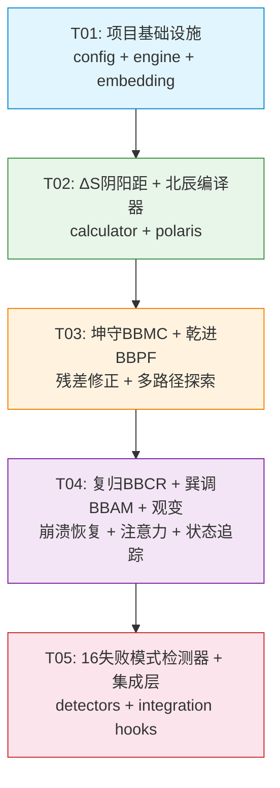

# 太极验证 1.0 (Taiji Verify) 系统设计文档

> 设计者: Bob (Architect)  
> 版本: 1.0  
> 日期: 2026-05-14

---

## Part A: 系统设计

### 1. 实现方案分析

#### 1.1 核心技术挑战

| 挑战 | 描述 | 解决方案 |
|------|------|---------|
| **语义度量** | 需要量化"回答偏离目标"的程度 | ΔS = 1 - cos(I, G) + 锚点扩展 |
| **任务分解** | 自然语言不可直接执行 | 北辰编译器: 9步编译管道 |
| **故障自愈** | 推理链漂移后自动恢复 | BBCR 三段式: collapse→reset→rebirth |
| **注意力调控** | 注意力分散导致输出不稳 | BBAM 方差门控: exp(-γ·σ) |
| **失败模式覆盖** | 16种可复现的LLM故障 | 结构化检测器 + 修复动作映射 |

#### 1.2 框架与库选择

| 库 | 版本 | 选择理由 | 替代方案 |
|---|------|---------|---------|
| `numpy` | ≥1.24 | 向量运算标准库，所有算法模块依赖 | - |
| `scipy` | ≥1.10 | 统计函数、李雅普诺夫指数计算 | - |
| `openai` | ≥1.0 | 嵌入API（快速原型） | `sentence-transformers` (本地) |
| `chromadb` | ≥0.4 | 向量数据库（Phase 2快速原型） | `faiss-cpu` (Phase 3生产) |
| `pydantic` | ≥2.0 | 数据模型验证 | `dataclasses` (标准库) |
| `loguru` | ≥0.7 | 结构化日志 | `logging` (标准库) |

#### 1.3 架构模式

采用 **分层架构 + 管道模式**：

```
┌─────────────┐   ┌─────────────┐   ┌─────────────┐
│  Layer 0    │   │  Layer 1    │   │  Layer 2    │
│  Embedding  │──▶│  ΔS Calc    │──▶│  Polaris    │
└─────────────┘   └─────────────┘   └──────┬──────┘
                                           │
                                    ┌──────▼──────┐
                                    │  Layer 3    │
                                    │  Mechanics  │
                                    │ BBMC→BBPF→  │
                                    │ BBAM→BBCR   │
                                    └──────┬──────┘
                                           │
                                    ┌──────▼──────┐
                                    │  Layer 4    │
                                    │  16 Failure │
                                    │  Detectors  │
                                    └─────────────┘
```

各层之间通过数据类传递状态，无循环依赖。

### 2. 文件清单

```
src/opentaiji/taiji_verify/
├── __init__.py                  # 模块导出
├── config.py                    # 全局配置 (所有模块阈值的中心化配置)
├── engine.py                    # TaijiVerifyEngine 主引擎接口
│
├── delta_s/
│   ├── __init__.py
│   ├── calculator.py            # ΔS 计算 (cosine + 锚点扩展)
│   └── thresholds.py            # 闸区判定 (safe/transit/risk/danger)
│
├── polaris/
│   ├── __init__.py
│   ├── compiler.py              # 北辰编译器主入口
│   ├── atom.py                  # 原子定义 (AtomRecord, AtomClass, AtomState)
│   ├── task_graph.py            # 任务依赖图构建
│   ├── token_board.py           # 执行令牌发放
│   └── leak_audit.py            # 下游泄漏审计
│
├── embedding/
│   ├── __init__.py
│   ├── provider.py              # EmbeddingProvider 抽象接口
│   ├── openai_provider.py       # OpenAI Embeddings 实现
│   ├── local_provider.py        # sentence-transformers 本地实现
│   └── cache.py                 # 嵌入向量缓存 (LRU)
│
├── mechanics/
│   ├── __init__.py
│   ├── kun_guard.py             # 坤守 BBMC (残差计算+投影最小化)
│   ├── qian_advance.py          # 乾进 BBPF (多路径扰动+耦合器)
│   ├── fu_return.py             # 复归 BBCR (崩溃检测+状态机)
│   ├── xun_tune.py              # 巽调 BBAM (方差门控+注意力调制)
│   └── guan_observe.py          # 观变 (状态追踪+指标聚合)
│
├── memory/
│   ├── __init__.py
│   ├── vector_store.py          # 向量数据库封装 (ChromaDB/FAISS)
│   └── semantic_tree.py         # 语义树节点管理
│
├── detectors/
│   ├── __init__.py
│   ├── failure_detector.py      # 16种失败模式检测器
│   └── repair_actions.py        # 修复动作定义
│
└── integration/
    ├── __init__.py
    ├── hooks.py                 # Agent Loop 集成hooks
    └── compat.py                # 旧版 WFGY 兼容层

tests/
├── test_delta_s.py              # ΔS 单元测试
├── test_polaris_compiler.py     # 北辰编译器测试
├── test_kun_guard.py            # 坤守测试
├── test_qian_advance.py         # 乾进测试
├── test_fu_return.py            # 复归测试 (含状态机)
├── test_xun_tune.py             # 巽调测试
├── test_failure_detector.py     # 16失败模式测试
└── test_integration.py          # 集成测试

docs/
├── system_design.md             # 本文件
├── class-diagram.mermaid        # 类图
└── sequence-diagram.mermaid     # 序列图

design/
└── 01-taiji-verify-technical-spec.md  # 完整技术规格书
```

### 3. 数据结构和接口

参见独立的类图文件: `docs/class-diagram.mermaid`

核心关系摘要:

```
TaijiVerifyEngine
 ├── TaijiEngineState (状态容器)
 ├── PolarisCompiler (北辰编译器)
 ├── FailureModeDetector (失败模式检测器)
 ├── VectorMemoryStore (语义树存储)
 └── [力学模块]
       ├── 坤守 BBMC → KunGuardResult
       ├── 乾进 BBPF → QianAdvanceResult
       ├── 复归 BBCR → FuReturnResult
       ├── 巽调 BBAM → XunTuneResult
       └── 观变 GuanObserve → GuanObserveSnapshot
```

### 4. 程序调用流程

参见独立的序列图文件: `docs/sequence-diagram.mermaid`

关键调用路径:

1. **预处理路径**: User → Integration → PolarisCompiler.compile() → EmbeddingProvider.embed() → ΔS Calculator
2. **主循环路径**: ΔS → 坤守 → λ计算 → 乾进 → 巽调 → 失败检测 → 泄漏审计 → 状态更新
3. **异常恢复路径**: 坤守COLLAPSE → 复归BBCR.collapse() → reset() → rebirth() → 重新循环

### 5. 不明之处与假设

| 不明之处 | 采用的假设 | 后续需确认 |
|---------|-----------|-----------|
| 嵌入模型未指定 | 默认 OpenAI text-embedding-3-small (1536维) | 政务场景是否有专用嵌入模型？ |
| 注意力分数来源 | 假设 LLM 提供 attention hook 或可获取 logits | 若不支持，BBAM 使用输出概率分布替代 |
| 北辰编译器 LLM 调用方式 | 假设可通过 LLM API 进行目标拆解 | 是否允许纯规则引擎降级？ |
| 16种失败模式检测阈值 | 采用算法设计草案阈值 | 需政务场景实际数据校准 |
| 复归重生成功判定 | ΔS 恢复到 SAFE 区 (<0.30) 视为成功 | 是否需要人工确认环节？ |
| 与现有 Agent Loop 的集成点 | 三个 hook (pre/post/error) | 实际 Agent Loop 架构是否支持？ |

---

## Part B: 任务分解

### 6. 所需包

```
numpy>=1.24.0               # 向量运算、线性代数
scipy>=1.10.0               # 统计函数、李雅普诺夫指数
openai>=1.0.0               # OpenAI Embeddings API
sentence-transformers>=2.2.0 # 本地嵌入模型 (降级)
chromadb>=0.4.0             # 向量数据库 (快速原型)
faiss-cpu>=1.7.0            # 向量数据库 (生产)
pydantic>=2.0.0              # 数据模型验证
pytest>=7.0.0               # 单元测试
loguru>=0.7.0               # 结构化日志
```

### 7. 任务列表

| ID | 任务名称 | 源文件 | 依赖 | 优先级 |
|----|---------|--------|------|--------|
| T01 | **项目基础设施**: 配置文件 + 入口文件 + 依赖声明 | `taiji_verify/__init__.py`, `taiji_verify/config.py`, `taiji_verify/engine.py`, `taiji_verify/embedding/provider.py`, `taiji_verify/embedding/openai_provider.py`, `taiji_verify/embedding/local_provider.py`, `taiji_verify/embedding/cache.py` | 无 | P0 |
| T02 | **ΔS阴阳距 + 北辰编译器**: 语义度量 + 任务原子化 | `taiji_verify/delta_s/calculator.py`, `taiji_verify/delta_s/thresholds.py`, `taiji_verify/polaris/compiler.py`, `taiji_verify/polaris/atom.py`, `taiji_verify/polaris/task_graph.py`, `taiji_verify/polaris/token_board.py`, `taiji_verify/polaris/leak_audit.py`, `tests/test_delta_s.py`, `tests/test_polaris_compiler.py` | T01 | P0 |
| T03 | **坤守 BBMC + 乾进 BBPF**: 残差修正 + 多路径探索 | `taiji_verify/mechanics/kun_guard.py`, `taiji_verify/mechanics/qian_advance.py`, `taiji_verify/memory/vector_store.py`, `taiji_verify/memory/semantic_tree.py`, `tests/test_kun_guard.py`, `tests/test_qian_advance.py` | T02 | P1 |
| T04 | **复归 BBCR + 巽调 BBAM + 观变**: 崩溃恢复 + 注意力调制 + 状态追踪 | `taiji_verify/mechanics/fu_return.py`, `taiji_verify/mechanics/xun_tune.py`, `taiji_verify/mechanics/guan_observe.py`, `tests/test_fu_return.py`, `tests/test_xun_tune.py` | T03 | P1 |
| T05 | **16失败模式检测器 + 集成层**: 失败模式检测 + Agent Loop 集成 | `taiji_verify/detectors/failure_detector.py`, `taiji_verify/detectors/repair_actions.py`, `taiji_verify/integration/hooks.py`, `taiji_verify/integration/compat.py`, `tests/test_failure_detector.py`, `tests/test_integration.py` | T04 | P2 |

### 8. 共享知识

```
- 所有 API 返回格式: {"code": int, "data": Any, "message": str}
- 嵌入向量默认维度: 1536 (text-embedding-3-small)
- 所有 ΔS 阈值以全局 config.py 为准 (不在各模块硬编码)
- 日期时间格式: ISO 8601 UTC
- 日志格式: loguru 结构化日志 {time} | {level} | {module} | {message}
- 错误处理: 所有异常通过 engine.py 统一捕获，不向外部暴露 traceback
- 测试策略: pytest + numpy.testing.assert_almost_equal (浮点运算)
- 向量数据库接口: 通过 VectorMemoryStore 抽象，可切换 ChromaDB / FAISS
- 兼容策略: 旧 WFGY 代码不修改，太极验证通过 integration/hooks.py 嵌入
```

### 9. 任务依赖图



---

*系统设计文档结束 · 太极验证 1.0*
